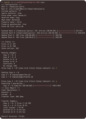

<p align="center">
  
</p>

# What is Synchi? 
Synchi keeps files in two places in sync. Each time it runs, it detects changes since the last run and leaves conflicts for the user to resolve. Unlike rsync or Unison, Synchi does not require any agent on remote hosts.


> **Note:** Synchi is in active development and currently in **alpha**. Breaking changes are expected.


## Features

- Detects changes since the last run to catch conflicts.
- Flexible conflict handling: mirror one way automatically or resolve conflicts interactively.
- Works with local and remote folders over SSH.
- Honors include/ignore rules (include defines the sync scope; out-of-scope paths are ignored, not deleted).
- Hashing for more accurate change detection.

Full documentation is available [here](docs/index.md).

## How it works

<p align="center">
  
</p>

Synchi synchronizes files in five steps:

1. Scan both roots, applying include/ignore rules and the selected hardlink mode.
2. Detect changes since the last run, using optional hashing for accuracy.
3. Compare the results to classify files as new, modified, or deleted.
4. Plan the operations, automatically handling or letting you resolve conflicts.
5. Execute the operations safely, batching transfers to avoid copying unchanged data.

Only genuinely new or changed files are transferred, making syncing efficient and reliable. Because Synchi keeps state between runs, repeated executions are fast and stable.

### Example output

A typical sync run: Synchi scans both roots, computes what changed, and executes only the necessary operations.

<p align="left">
  
</p>

## Requirements

Synchi needs a few standard tools on each root (local or remote) to work properly:

- `find` with `-printf` support
- `tar` for packing and unpacking batches
- `sha256sum` or a compatible implementation

These tools are usually already installed on most Linux systems.

## Installation

```bash
git clone https://github.com/jakobkreft/synchi.git
cd synchi
cargo install --path .
```

## Usage

### Initialization

You can initialize the local database explicitly (optional, `sync` will auto-init):

```bash
synchi init --root-a ./folderA --root-b ./folderB
```

### Syncing

```bash
# Local <-> local
synchi sync --root-a ./folderA --root-b ./folderB

# Local <-> remote (ssh://, allows custom port 8022, etc.)
synchi sync --root-a ./folderA --root-b ssh://user@host:8022/remote/path

# Note: Only ssh:// is supported for remote roots.
# scp-style user@host:/path is not supported.
```

Root A always holds `.synchi` and the SQLite database, so it must be writable.
`synchi status` is read-only, and `synchi sync` prints the summary before touching either root. During execution, Synchi creates a `.synchi` marker directory on root B to confirm write access.

Each `synchi sync` run prints the same status summary as `synchi status` before touching either root. Synchi then prompts for every category that still has pending work—`Copy A → B`, `Copy B → A`, `Delete on A`, and `Delete on B`. Answer `y`/`n` for all categories and use `l` to list pending paths. Pass `-y/--yes` to auto-approve all unanswered categories, or use the explicit flags below to pre-decide:

```
--copy-a-to-b allow|skip
--copy-b-to-a allow|skip
--delete-on-a delete|restore|skip
--delete-on-b delete|restore|skip
```

`restore` is available through CLI overrides only.

Combine these with `--dry-run` when you only want the summary without executing anything.


Run `synchi sync --help` for more info about options.

### Data Safety

Synchi is designed to be predictable, but it can delete or overwrite data if you approve those actions.

Safe by default:
- `synchi status` is read-only.
- `--dry-run` shows exactly what would happen.
- Sync prompts for each category unless you pre-approve or use `--yes`.

Destructive actions:
- Deletes happen only when you choose `delete` for a delete category.
- `force = "root_a"` or `"root_b"` will mirror one side, which can remove data on the other side.

When in doubt, run `synchi status` or `synchi sync --dry-run` first and keep a separate backup.

### Configuration reference

| Key            | Description |
| -------------- | ----------- |
| `root_a`, `root_b` | Paths or SSH specs (`ssh://user@host:port/path`). scp-style `user@host:/path` is not supported. |
| `include`      | Glob allow-list; default `["**"]`. Only included paths are scanned or synced. An empty list means “sync nothing” and emits a warning. |
| `ignore`       | Glob block-list applied after include; `.synchi` is always ignored. Ignored paths are excluded from scanning and won’t be deleted. |
| `hardlinks`    | `"copy"` (default), `"skip"`, or `"preserve"`. Copy mode does not explicitly preserve links (tar may still keep them). Skip mode removes any path that belongs to a hardlink group on either side. Preserve mode recreates hardlinks and errors if unsupported. |
| `force`        | `"root_a"`, `"root_b"`, or `"none"` (empty/omitted) to control mirroring. |
| `hash_mode`    | `"balanced"` (default) or `"always"`. Balanced hashes a file only when its mtime/size changed and uses the hash to confirm the change; always hashes every file. |
| `preserve_owner` | Default `true`. When `false`, tar extraction runs with `--no-same-owner`, so files keep the destination user’s ownership (useful for SMB/NAS/FUSE targets that reject `chown`). |
| `preserve_permissions` | Default `true`. When `false`, Synchi skips `chmod`/`touch` steps and omits `--preserve-permissions`, letting the destination filesystem assign modes/mtimes. |
| `state_db_name` | Optional label inside `.synchi/` for the state database. Synchi appends `.db`, so `project` becomes `.synchi/project.db` (default `state.db`). |

All options can also be overridden via CLI flags (e.g., `--root-a`, `--root-b`, `--hardlinks`, `--hash-mode`, `--force root_a`, `--state-db-name archive`, `--dry-run`, `-y`, `--copy-a-to-b skip`).

Create your own config file `config.toml`

Example:

```toml
# Synchi Configuration File

# Paths for the two roots. Can be local or remote via SSH
root_a = "./local_root"
root_b = "ssh://user@host/path/to/remote_root"

# One-way or bidirectional sync:
# "root_a" - mirror root_a to root_b
# "root_b" - mirror root_b to root_a
# "none"   - bidirectional (default)
force = "root_a"

# Hashing strategy: "balanced" (default) or "always"
hash_mode = "balanced"

# Hardlink handling: "copy" (default), "skip", or "preserve"
hardlinks = "skip"

# Preserve ownership and permissions on synced files
preserve_owner = false
preserve_permissions = true

# Include patterns (files/directories to sync). An empty list means “sync nothing”.
include = ["**/*.txt", "**/docs/**"]

# Ignore patterns (files/directories to skip)
ignore = ["**/temp", "**/cache", "**/ignore_me/**"]
```
Run Synchi with your configuration file:

```bash
synchi -c /path/to/config.toml sync
```

This will perform a sync according to the settings in your config file.


### Tips

- Use `synchi -v ...` to surface detailed tracing, including scan locations and remote commands.
- When in doubt, run `synchi status` first; it takes the same code path as `sync` without mutating either root.
- Use the `ssh://` form for all remote roots.
